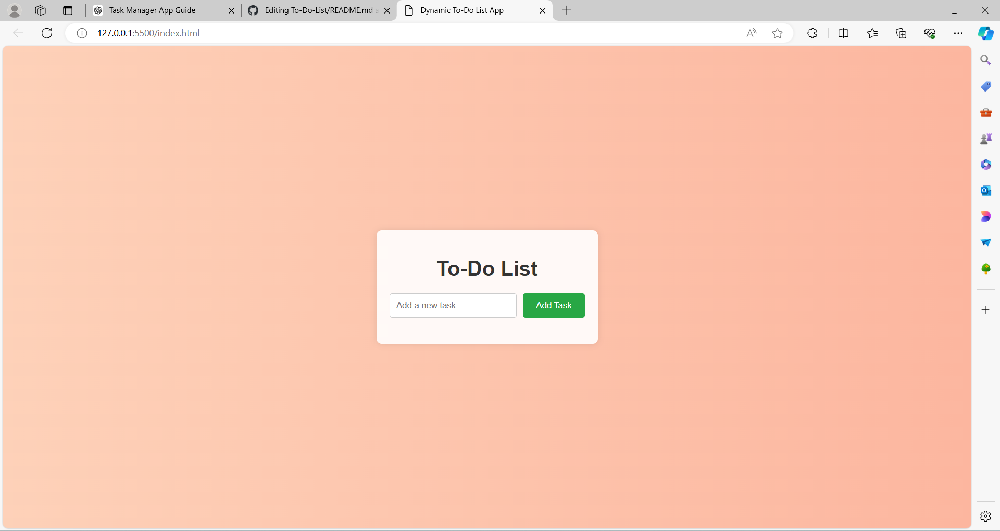

# Dynamic To-Do List App

A dynamic, light-colored To-Do List application with additional features and background animation. This app is built using HTML, CSS, and JavaScript, and it includes functionalities for adding, editing, and deleting tasks, with tasks persisted in local storage.

## Features

- Add new tasks
- Edit existing tasks
- Delete tasks
- Persistent storage using local storage
- Responsive and scrollable task list
- Light-themed design with background animation

## Preview



## Getting Started

Follow these instructions to get a copy of the project up and running on your local machine for development and testing purposes.

### Prerequisites

- A modern web browser (Chrome, Firefox, Safari, etc.)
- Code editor (VSCode, Sublime Text, etc.)

### Installation

1. Clone the repository:
    ```sh
    git clone https://github.com/yourusername/todo-list-app.git
    ```

2. Navigate to the project directory:
    ```sh
    cd todo-list-app
    ```

3. Open the `index.html` file in your web browser to view the app:
    ```sh
    open index.html
    ```

## Files

- `index.html`: The main HTML file containing the structure of the app.
- `style.css`: The CSS file containing styles for the app.
- `app.js`: The JavaScript file containing the logic for the app.

## Usage

1. **Adding a Task**:
   - Type your task into the input field.
   - Click the "Add Task" button or press "Enter" to add the task to the list.

2. **Editing a Task**:
   - Click the "Edit" button next to the task you want to edit.
   - Modify the task in the input field that appears and click "Save" to save the changes.

3. **Deleting a Task**:
   - Click the "Delete" button next to the task you want to remove.

## Contact

Your Name - [@LandaRashmi](https://www.linkedin.com/in/rashmi-landa-294796255/) - rashmilanda@gmail.com

Project Link: [https://github.com/LandaRashmi/To-Do-List](https://github.com/LandaRashmi/To-Do-List)


